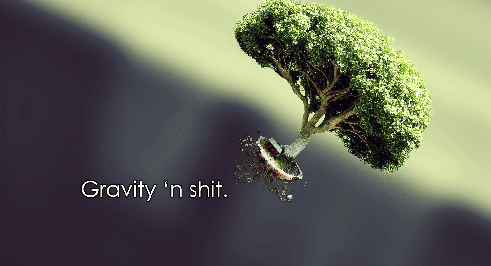

# ORSAT

## What is ORSAT and How do I see it?

ORSAT or the **OR**bital **S**imul**AT**or is a 3D simulation of an N-body interaction due to gravity. To run ORSAT clone down the repository and execute

> python3 run.py --view

This will run a random configuration of the N bodies defined in "settings.toml". Use the --view flag anytime you wish to see the program running live, a little like this...

### What's the big slider for?

The big slider is to control the length of the position history that is displayed. This is all configured in "gravtails.py". As defined in "settings.toml", the maximum history stored is 100 seconds, and this slider allows you to control how much of the history is shown at any time.

- **slide left** - reduce the length of the history shown
- **slide_right** - increase the length of the history shown

You may notice that initially, the gravtails are not as large as the slider allows. This is because the simulation starts at time 0, and as time goes on, the history is recorded in the buffer. Therefore to view the maximum length, the first 100 seconds of simulated time must have occured.

## Kinematics

A **body** is defined as a mass which has an associated state vector containing:

- Position (x, y, z)
- Velocity (vx, vy, vz)
- Acceleration (ax, ay, az)

Each body has a given mass *m*. Every body interacts with every other body due to gravity.
We use "[Newton's Law of Universal Gravitation](https://en.wikipedia.org/wiki/Newton%27s_law_of_universal_gravitation)" to calculate the **net** force acting on each body.

When calculating the net force acting on each body, we exploit the fact that between a body i and another body j, the force is Fij = -Fji and Fii = Fjj = 0. This reduces the total number of force calculations required by half.

### Numerical Integration

To compute [x, y, z, vx, vy, vz] for timestep t + dt using the information [vx, vy, vz, ax, ay, az] at timestep t, there is no closed-form solution to these equations (generally speaking; for smaller number of bodies there is). Therefore to solve for [x, y, z, vx, vy, vz] we must numerically integrate [vx, vy, vz, ax, ay, az] at every timestep. To do this we have implemented two approaches:

1. [Runge-Kutta](https://en.wikipedia.org/wiki/Runge%E2%80%93Kutta_methods)
2. [Huen Predictor-Corrector](https://en.wikipedia.org/wiki/Heun%27s_method)

As these are readily accessible and well-documented algorithms we will not provide a detailed explanation, but will discuss implementation details.

#### Runge-Kutta (environment.py -> def runge_kutta(self))

Runge-Kutta or RK for short can be run in order 1, 2, 3 or 4. "settings.toml" contains the numerical integration constants, and the option for selecting which order you desire. As the order increases, so too does the integration accuracy. A fixed time-step dt is used to perform the integration.

#### Huen Predictor-Corrector (environment.py -> def huen_predictor_corrector(self)

Huen Predictor-Correct or HPC for short allows you to select the accuracy and maximum number of timesteps you wish to run the loop to improve the accuracy of the integration for a given timestep. If the accuracy is not achieved within the maximum number of timesteps, the last result for [x, y, z, vx, vy, vz] is used. A fixed time-step dt is used to perform the integration.

## Configuring ORSAT

### Random configuration

A random configuration of N bodies can be enabled with the **--random** flag.

### Custom configuration

Configurations are located in **configuration/** and can be used at startup of program execution with the flag **--config [id]**, where id is the unique identifier of the configuration. All configurations override:

- Positions
- Velocities
- Masses
- Names
- G (Universal gravitation constant)
- N (number of bodies)

Configurations are defined in a .csv file, which should maintain the structure:
| Name | mass (kg) | x (m) | y (m) | z (m) | vx (m/s) | vy (m/s) | vz (m/s) |
| --- | --- | --- | --- | --- | --- | --- | --- |
| Body1 | mass | start x | start y | start z | start vx | start vy | start vz |

Any new start configuration csv should be referenced in **configuration/settings.toml**, with the following structure, where **[id]** is the unique identifier which will be used to refer to the given configuration.

    [configs.[id]]
    # Description: (optional)
    file = "[configuration_filename].csv"
    G = value of G

Once included, at start of the program, the configuration can be selected using **--config [id]**.

## Future work (aka TODO)

This work is to be done optimistically as time permits.

### Bug fixes

- In the gui, when the slider is "slammed" to the left after fully dragging it to the right first, the gravtails get access to part of the array that is still 0'd out. However, when the slider is dragged normally to the left of the screen, the program functions as expected.
    - Current fix: remove any 0 elements that may exist in the trail.

### Future Work

- Create "good" default configurations to show interesting body interactions.
- Add titles to the slider for the time
- Add a current simulation time to the display
- Multiprocess a headless version of ORSAT for data collection
- Figure out a game logic
    - Currently thinking gravity slingshot, and controlling a body to reach a "point". E.g. a field of many bodies.
    - Other opportunity is a multi-agent adversarial game where if they get close enough and "collide" they absorb the mass etc of another body, and whichever original body captures the rest "wins" (or has the largest mass) when those two remain.
        - Quite complex game mechanics involved
    - Maintaining a stable orbit with thrust
- Given that game logic, using reinforcement learning (DeepQ, PPO, A2C) coupled with attention mechanisms or other encodings to develop a controller for the game (compare against an optimal approaches which exist).